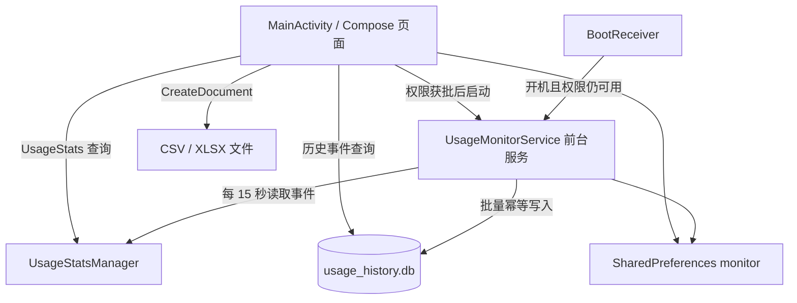
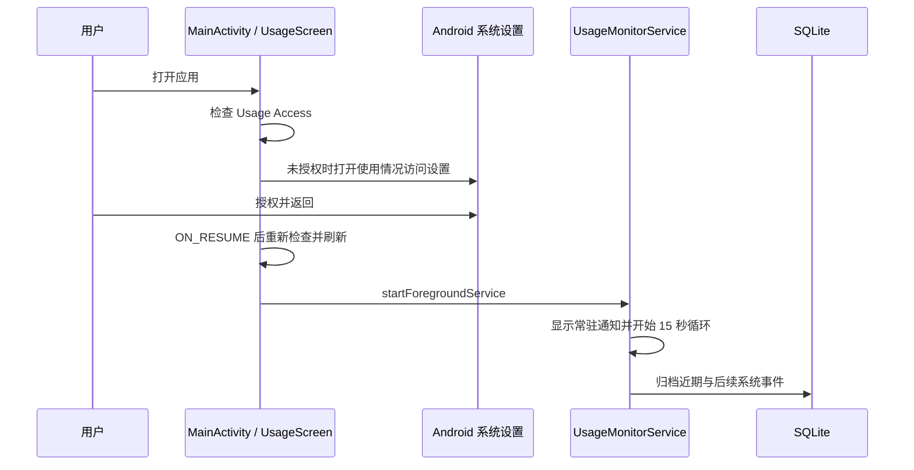
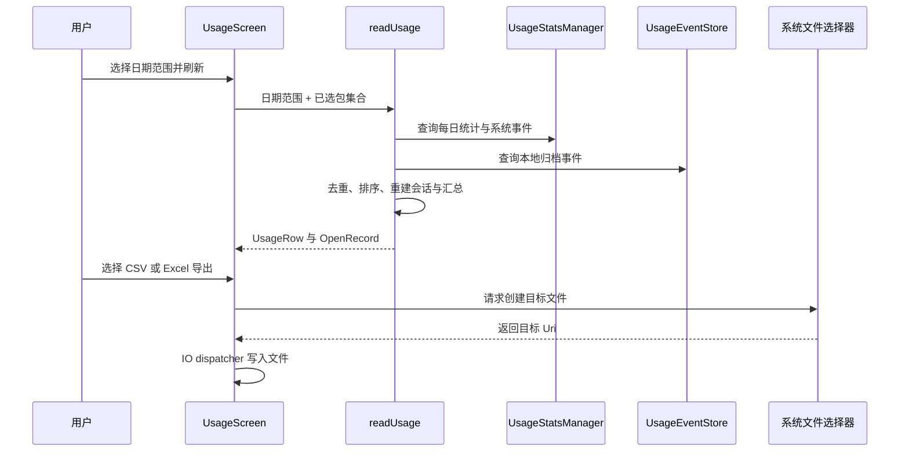

# App 使用时长监控项目详细设计

## 1. 文档信息

| 项目 | 内容 |
|---|---|
| 项目名称 | App 使用时长监控 |
| 应用 ID | `top.qiutq1.appusagemonitor` |
| 文档范围 | 当前源码实现，包括前台页面、后台事件采集、本地归档、查询和文件导出 |
| 主要源码 | `MainActivity.kt`、`UsageMonitorService.kt`、`AndroidManifest.xml` |

本文描述当前实现，不代表 Android 能提供设备上从未采集或已过期删除的历史数据。运行时行为还会受 Android 版本、系统权限和厂商后台管理策略影响。

## 2. 项目目标与功能范围

应用通过 Android `UsageStatsManager` 读取应用使用统计和前后台事件，按本地日期范围计算使用时长、启动次数和每次使用区间。为突破系统事件通常只能查询近期数据的限制，应用通过前台服务周期性读取事件并存入本机 SQLite，供之后查询。

当前功能包括：

- 按日期范围查询应用前台时长、启动次数和打开/结束时间。
- 选择需要在汇总中统计的应用，并按中文拼音首字母搜索和排序。
- 将当前日期范围内的打开记录导出为 CSV 或 `.xlsx`。
- 通过前台服务持续采集使用事件，并在设备重启后尝试恢复。
- 配置是否继续向本地 SQLite 归档事件，以及退出时是否从最近任务中移除应用任务卡片。

## 3. 技术与运行环境

| 项目 | 当前配置 |
|---|---|
| 平台 | Android |
| 最低 SDK | 26 |
| 编译 SDK | 35 |
| 目标 SDK | 35 |
| 语言 | Kotlin，JVM target 11 |
| UI | Jetpack Compose、Material 3 |
| 异步处理 | Kotlin 协程、IO dispatcher |
| 本地事件存储 | Android SQLite API (`SQLiteOpenHelper`) |
| 文件保存 | Storage Access Framework (`CreateDocument`) |
| 中文排序 | pinyin4j |

项目没有引入 Room 或 Excel 第三方库。`.xlsx` 由标准 ZIP 与 Open XML 工作簿部件直接生成。

## 4. 总体架构



### 4.1 主要组件

| 组件 | 职责 |
|---|---|
| `MainActivity` | 启动 Compose UI；按返回键时读取隐藏最近任务设置并结束任务或 Activity。 |
| `UsageScreen` | 管理页面状态、权限引导、日期范围、应用选择、刷新、设置和导出交互。 |
| `UsageMonitorService` | 以 `specialUse` 前台服务运行，周期性从系统取前后台事件并按偏好写入 SQLite。 |
| `UsageEventStore` | 创建、插入和读取 SQLite 事件表；使用事务与主键避免重复写入。 |
| `BootReceiver` | 收到 `BOOT_COMPLETED` 后检查 Usage Access 权限并尝试启动服务。 |
| `readUsage()` | 合并系统事件和本地归档事件，计算时长、启动次数及使用记录。 |
| `exportCsv()` / `exportExcel()` | 分别生成 UTF-8 CSV 和包含单工作表的 `.xlsx` 文件。 |

## 5. 页面与交互设计

### 5.1 首页

首页默认显示本地当天的日期范围。页面包含：

1. 标题和设置入口。
2. 可点击的日期范围入口。
3. 总前台时长、应用数和启动次数概览。
4. 应用管理、刷新、导出菜单。
5. 按使用时长或应用名称排序的汇总列表。
6. 打开记录列表。首页最多显示当前范围内最近的 100 条记录。

点击汇总项可查看该应用在当前范围中的打开与结束时间。CSV 和 Excel 导出使用完整的 `records` 集合，并不受首页 100 条展示限制。

### 5.2 权限引导

应用通过 `AppOpsManager.OPSTR_GET_USAGE_STATS` 检查 Usage Access。未授权时显示说明和系统设置跳转按钮；Activity 恢复到前台后重新检查权限。获权后刷新流程启动 `UsageMonitorService`。

`PACKAGE_USAGE_STATS` 是用户在系统“使用情况访问”页面授予的特殊访问权限，不是普通运行时权限弹窗。

### 5.3 应用管理

应用列表由 `PackageManager` 查询带有 `ACTION_MAIN` 和 `CATEGORY_LAUNCHER` 的启动器应用，按包名去重。首次运行且尚无 `packages` 偏好时，默认选中查询到的全部启动器应用。用户选择保存到 SharedPreferences。

搜索同时匹配应用标签和拼音字符串；排序键为拼音首字母、拼音全文、应用标签。

### 5.4 日期范围

日期选择器允许选择开始日期与结束日期，并限制结束日期不超过今天。内部使用本地时区的自然日边界：开始时间为开始日零点，查询结束时间为结束日次日零点（不包含）。结束范围再被限制到当前时间。

### 5.5 设置

设置保存在 `monitor` SharedPreferences：

| Key | 默认值 | 行为 |
|---|---:|---|
| `save_old_history` | `true` | 开启时，前台服务将读取到的前后台事件写入 SQLite。关闭时停止写入并持续推进采集游标；已有数据库数据不删除，关闭期间的事件不会在重新开启后补录。 |
| `hide_from_recents_on_exit` | `false` | 开启后，Activity 收到 Android 返回键时调用 `finishAndRemoveTask()`，移除应用最近任务卡片；关闭时仅调用 `finish()`。 |

“隐藏最近任务”由返回键退出路径实现。使用 Home/手势将应用切到后台并不等同于 Activity 退出，不会在该路径主动移除任务卡片。

## 6. 后台采集与事件模型

### 6.1 服务生命周期

- Activity 创建时若已有 Usage Access 权限，会尝试启动服务。
- 页面每次刷新也会检查权限并尝试启动服务。
- Android O 及以上使用 `startForegroundService()`，较早版本使用 `startService()`。
- 服务创建后立即创建低重要性通知渠道并调用 `startForeground()`，通知标题为“应用使用记录采集中”。
- 服务返回 `START_STICKY`，并以协程在 IO dispatcher 上循环采集，每轮间隔 15 秒。
- 设备完成启动后，`BootReceiver` 在权限可用时尝试恢复服务。
- 服务销毁时取消协程并关闭 SQLite helper。

服务使用 `UsageStatsManager.queryEvents(from, now)` 获取事件。首次采集从当前时间前 10 天开始，后续从 SharedPreferences 中的 `event_cursor - 2 秒` 开始，以覆盖相邻轮次边界。每次处理结束后将游标更新到当前时间。SQLite 主键和 `INSERT OR IGNORE` 对重叠部分做幂等去重。

只归档平台版本对应的前后台状态事件：Android Q 及以上使用 `ACTIVITY_RESUMED` 和 `ACTIVITY_PAUSED`；较早版本使用 `MOVE_TO_FOREGROUND` 和 `MOVE_TO_BACKGROUND`。服务不保存本应用自身的事件。

当 `save_old_history=false` 时，采集循环不查询和写入事件，只把游标推进到当前时间；重新打开归档后从新游标附近继续，不回填关闭期间事件。

### 6.2 使用会话重建

查询时，`readUsage()` 按时间顺序合并系统 `UsageEvents` 和 SQLite 中的归档事件，并按“包名、Activity 类名、事件类型、时间戳”去重。

- Android Q 及以上：Activity resumed 时将 Activity 加入该包的前台 Activity 集合；paused 时移除。包内最后一个前台 Activity 暂停后记录待结束时刻。
- Android Q 以下：前台事件开始会话，后台事件结束会话。
- 会话结束后累加事件推算时长并产生一条 `OpenRecord`。
- 对 Activity 切换保留 2 秒宽限，减少同一应用内部页面切换被拆成多个会话的情况。
- 查询结束时仍未结束的会话以查询结束时间收尾。

### 6.3 统计汇总

除事件推算时长外，查询会通过 `queryUsageStats(INTERVAL_DAILY, start, end)` 汇总系统每日前台时长。每个应用展示的时长为系统每日汇总时长与事件推算时长中的较大者，避免直接相加造成双重计时。启动次数从事件会话起始事件计数。

只为当前选中的包生成汇总。应用标签从当前已安装启动器应用中查找；若事件中的包名当前不可解析，会话记录使用包名作为显示名称。

## 7. 本地数据设计

### 7.1 SQLite

数据库文件：`usage_history.db`，由 `UsageEventStore` 管理。当前版本为 1。

表 `usage_events`：

| 字段 | SQLite 类型 | 约束 | 含义 |
|---|---|---|---|
| `package_name` | TEXT | NOT NULL，主键字段 | 应用包名 |
| `class_name` | TEXT | NOT NULL，主键字段 | Activity 类名；空值存为空字符串 |
| `event_type` | INTEGER | NOT NULL，主键字段 | Android UsageEvents 事件类型 |
| `timestamp` | INTEGER | NOT NULL，主键字段 | Unix epoch 毫秒时间戳 |

组合主键为 `(package_name, class_name, event_type, timestamp)`。当前数据库保存原始事件，不单独持久化会话或汇总；查询时实时重建会话。

插入操作采用 SQLite 事务。冲突通过 `INSERT OR IGNORE` 忽略。查询以时间戳下限和上限过滤，并按时间升序返回。

### 7.2 SharedPreferences

文件名为 `monitor`，主要数据项如下：

| Key | 用途 |
|---|---|
| `packages` | 用户选择参与汇总的包名集合 |
| `event_cursor` | 后台服务的最近采集时间游标（毫秒） |
| `save_old_history` | 是否继续写入 SQLite，默认 `true` |
| `hide_from_recents_on_exit` | 返回键退出时是否移除最近任务，默认 `false` |

## 8. 导出设计

文件通过 Android `ActivityResultContracts.CreateDocument` 交由系统文件选择器创建，应用不自行指定用户存储路径。

### 8.1 CSV

- MIME：`text/csv`。
- UTF-8 编码并写入 BOM，便于常见表格软件识别中文。
- 字段：应用名称、包名、打开时间、结束时间、使用时长（毫秒）。
- 文本字段使用双引号包围，并将内部双引号转义为两个双引号。

### 8.2 Excel

- MIME：`application/vnd.openxmlformats-officedocument.spreadsheetml.sheet`。
- 扩展名：`.xlsx`。
- 使用 ZIP 容器写入最小 Open XML 工作簿结构：内容类型、根关系、工作簿、工作簿关系、单张工作表。
- 文本单元格以 `inlineStr` 形式写入并转义 XML 特殊字符；时长以数值毫秒单元格写入。
- 工作表字段与 CSV 一致；时间当前以本地化格式化后的文本单元格写入。

两种导出均输出当前查询范围的所有 `OpenRecord`，记录按开始时间升序组织。文件名包含起止日期。

## 9. 权限与 Manifest 配置

Manifest 声明：

- `PACKAGE_USAGE_STATS`：查询应用使用事件和时长。
- `FOREGROUND_SERVICE` 与 `FOREGROUND_SERVICE_SPECIAL_USE`：启动 special-use 前台服务。
- `RECEIVE_BOOT_COMPLETED`：设备重启后尝试恢复采集。
- `<queries>` 中的 Launcher Intent：查询启动器应用。

`UsageMonitorService` 标记为非导出，并声明 `specialUse` 前台服务类型及用途子类型说明。`BootReceiver` 处理 `BOOT_COMPLETED`。Activity 作为应用入口导出。

## 10. 关键流程

### 10.1 首次授权并开始采集



### 10.2 查询与导出



## 11. 失败场景和已知限制

1. **无法恢复授权前的历史**：Usage Access 开启之前没有本应用的采集记录。首次启动只能从系统当时仍提供的事件窗口进行回填，无法恢复系统已清理的更早事件。
2. **采集不是系统级保证**：服务会受系统杀进程、省电策略、用户强制停止和厂商后台限制影响。重启接收器不保证所有设备都能立即启动服务。
3. **事件空档**：若服务中断时间超过系统仍保留事件的窗口，中断段可能永久缺失。
4. **归档开关语义**：当前实现关闭时暂停所有 SQLite 新写入，而非仅过滤“早于 10 天”的事件；近期数据仍可能由 `UsageStatsManager` 在可用窗口内查询到。关闭期间游标继续前进，不会在重新开启时补写该段事件。
5. **会话边界不完整**：查询范围从会话中间开始时，缺少范围之前的起始事件可能导致该次会话无法完整重建；设备关机、数据清理或事件缺失也会影响开始/结束时间。
6. **汇总与事件记录来源不同**：使用时长可来自系统每日统计，打开记录和启动次数依赖 UsageEvents。因系统事件不可用而每日统计仍可用时，可能存在时长汇总但没有详细打开记录。
7. **当前安装应用映射**：应用选择列表只包含当前 Launcher 应用；曾安装但已卸载的包不能通过应用管理列表重新选择。部分事件的显示标签会退化为包名。
8. **页面展示数量**：首页详细打开记录最多展示 100 条；导出不受这一展示上限影响。
9. **最近任务隐藏范围**：当前只在 Activity 的返回键退出回调中按设置移除 task；按 Home 或手势切后台不会触发同样的移除操作。
10. **Excel 时间格式**：时间列当前写为本地格式文本，而不是 Excel 日期序列；时长列是毫秒整数。Excel 可打开和筛选这些字段，但若要按日期做原生日期运算，需后续改为日期数值及单元格格式。
11. **错误反馈有限**：当前导出和查询流程没有完整的面向用户异常提示；文件创建失败、数据库读写失败等问题可能只表现为操作未完成。

## 12. 维护与扩展建议

- SQLite schema 发生变化时提升 `SQLiteOpenHelper` 数据库版本，并实现对应迁移逻辑；当前 `onUpgrade()` 尚为空实现。
- 可将查询/统计和 UI 分层为 Repository 与 ViewModel，以便隔离 Compose 状态并提高可测性。
- 若需严格控制超过 10 天的数据量，可在服务归档时保留近期缓存与长期归档策略，或定期清理短期数据；当前设置开关是全局暂停/恢复写入。
- 可为 XLSX 添加日期数值格式、列宽、冻结首行和样式定义，保持 `.xlsx` 结构兼容。
- 可增加服务状态、最近采集时间、数据库容量和异常反馈，便于用户判断后台采集是否持续工作。
- 应在真实设备上验证不同 Android 版本下的 special-use 前台服务、通知展示、重启接收器和厂商省电策略。

## 13. 构建入口

项目使用 Gradle Wrapper。典型调试构建命令：

```shell
./gradlew :app:assembleDebug
```

Android Studio 可直接导入项目并使用 Gradle 同步。构建环境需使用与 Android Gradle Plugin 8.8 兼容的 JDK，并安装 Android SDK 35。
